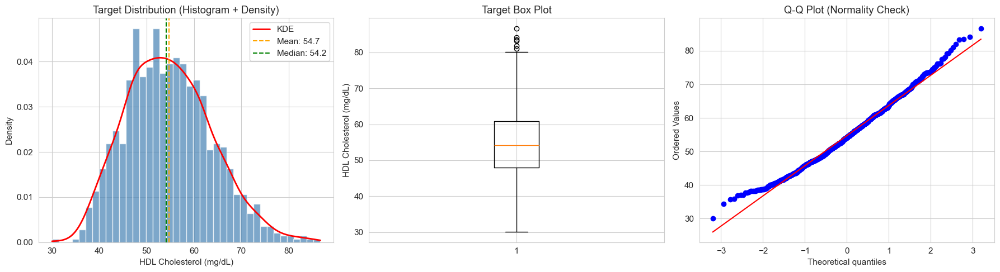
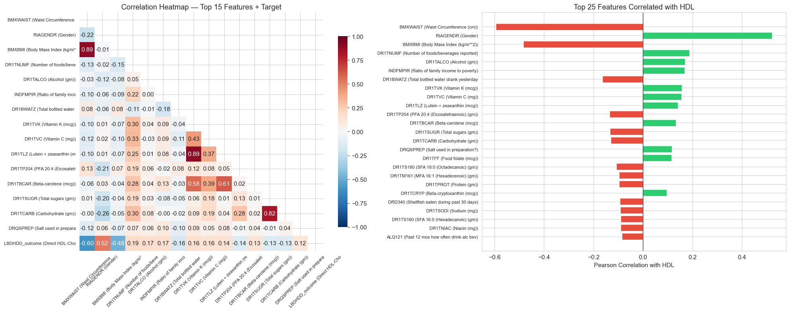
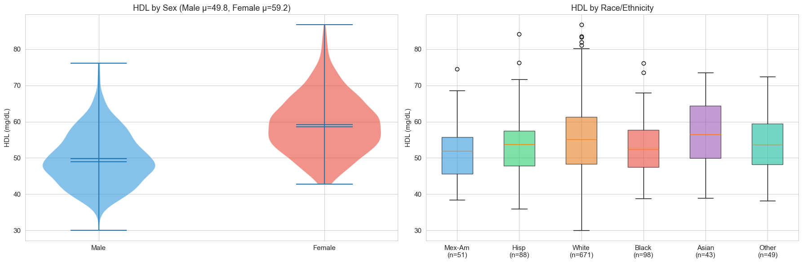
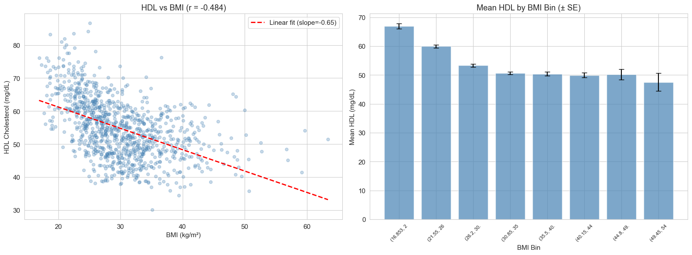
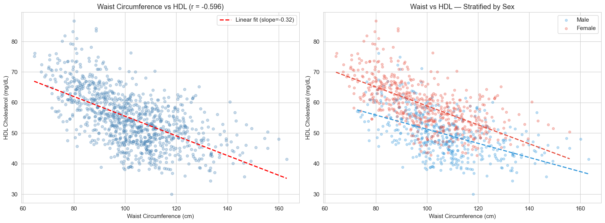
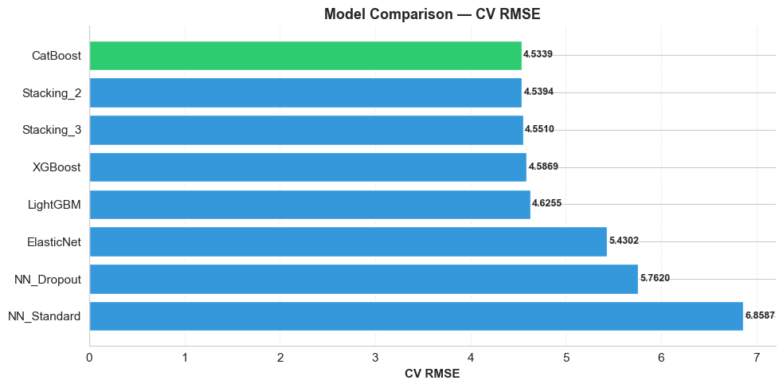
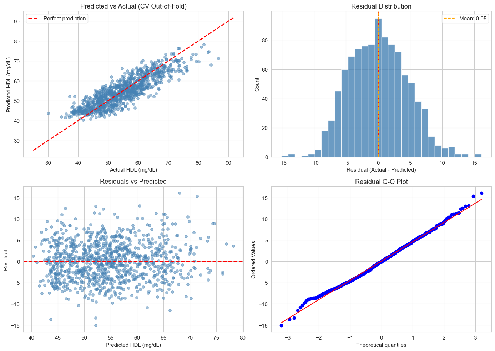
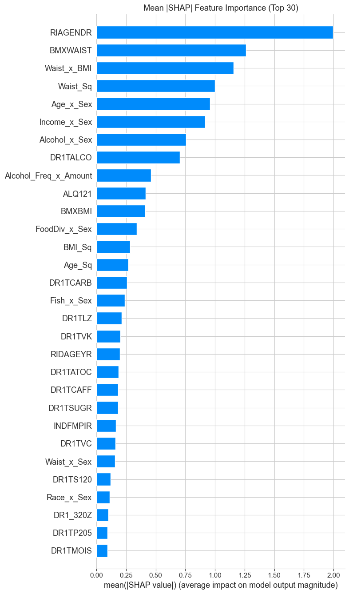
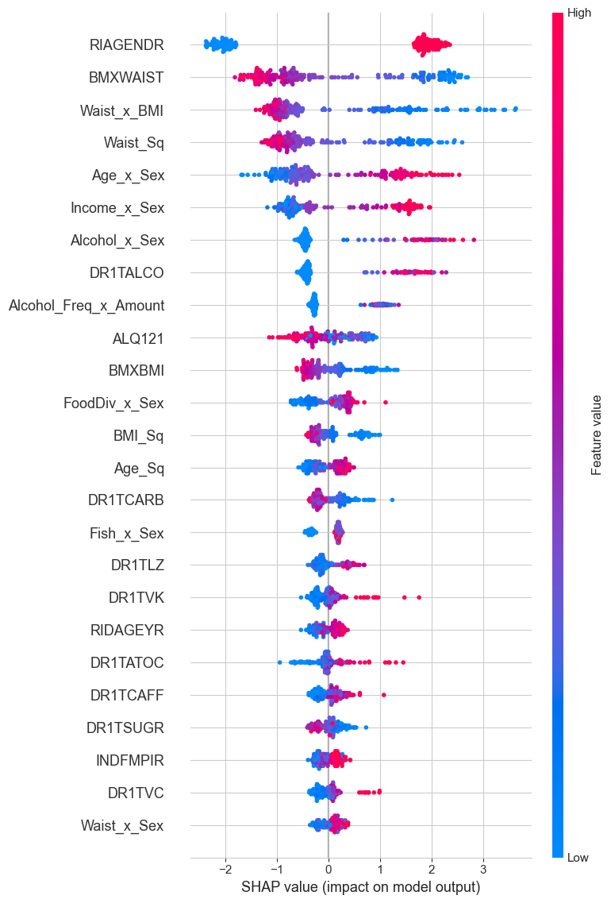
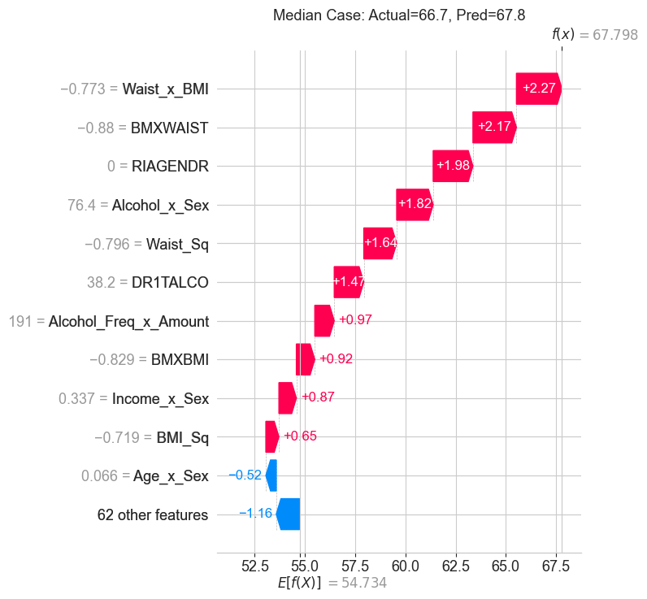

# Predicting HDL Cholesterol from NHANES Survey Variables

[](https://github.com/luminwin/ASASF)
[]()
[]()
[]()
[]()

> **2026 ASA South Florida Student Data Challenge — Graduate Prediction Track**
>
> Can we predict HDL cholesterol from routinely collected survey data — without requiring laboratory lipid panels?

## Authors

| Name | Affiliation | Contact |
|------|------------|---------|
| **Daniel Regalado** | University of Miami | [dxr1491@miami.edu](mailto:dxr1491@miami.edu) |
| **Miguel Rocha** | University of Miami | |

---

## Table of Contents

- [Motivation](#motivation)
- [Competition Overview](#competition-overview)
- [Dataset](#dataset)
- [Repository Structure](#repository-structure)
- [Exploratory Data Analysis](#exploratory-data-analysis)
- [Feature Engineering](#feature-engineering)
- [Model Selection & Results](#model-selection--results)
- [Residual Diagnostics](#residual-diagnostics)
- [Interpretability (SHAP)](#interpretability-shap)
- [Reproducibility](#reproducibility)
- [License](#license)

---

## Motivation

Low HDL cholesterol is a well-established risk factor for cardiovascular disease, the leading cause of death worldwide. Direct measurement of HDL requires laboratory lipid panels that are costly and not universally available, particularly in resource-limited settings. This project explores whether routinely collected survey data — demographics, anthropometrics, dietary intake, and behavioral indicators — can serve as a reliable proxy for HDL estimation, enabling early screening and risk stratification at scale.

## Competition Overview

The [2026 ASA South Florida Student Data Challenge](https://github.com/luminwin/ASASF) is organized by the American Statistical Association's South Florida Chapter. Participants build predictive models using NHANES (National Health and Nutrition Examination Survey) data to forecast Direct HDL-Cholesterol (`LBDHDD_outcome`, mg/dL). Submissions are evaluated on **Root Mean Squared Error (RMSE)**, with the top 30% advancing to final judging based on report quality and analytical rigor.

## Dataset

| Split | Observations | Features | Missing Values |
|-------|-------------|----------|----------------|
| Train | 1,000 | 95 | None |
| Test  | 200 | 95 | None |

The 95 predictor variables are sourced from the 2024 NHANES cycle and span four domains: **demographics** (age, gender, race/ethnicity, income-to-poverty ratio, marital status), **anthropometrics** (BMI, waist circumference), **dietary intake** (24-hour recall data covering macronutrients and micronutrients), and **behavioral indicators** (alcohol consumption frequency and quantity).

The target variable (`LBDHDD_outcome`) is a noise-adjusted version of Direct HDL-Cholesterol (mg/dL), approximately normally distributed (mean = 54.73, median = 54.16, skewness = 0.376).

## Repository Structure

```
.
├── README.md                          # This file
├── METHODS.md                         # Detailed methodology & technical decisions
├── requirements.txt                   # Python dependencies
├── .gitignore                         # Git ignore rules
├── LICENSE                            # MIT License
├── figures/                           # All visualizations used in this README
├── notebooks/
│   └── Submission_DanielRegalado_MiguelRocha.ipynb   # Full analysis notebook
├── reports/
│   └── DanielRegalado_MiguelRocha.pdf                # 3-page competition report
└── predictions/
    └── pred.csv                                       # Final test predictions (200 rows)
```

---

## Exploratory Data Analysis

### Target Distribution

The target variable is approximately normal with mild right skew. The Q-Q plot confirms no need for target transformation.

<p align="center">
  
</p>

### Correlation Structure

Waist circumference (*r* = −0.596) and BMI (*r* = −0.484) are the strongest linear predictors. Gender shows a strong positive association (*r* = +0.523). Dietary variables are uniformly weak in isolation (|*r*| < 0.19).

<p align="center">
  
</p>

### HDL by Sex and Race/Ethnicity

Females exhibit systematically higher HDL levels (mean 59.2 vs. 49.8 mg/dL for males), a ~9.4 mg/dL gap consistent with established endocrine mechanisms. Race/ethnicity shows more subtle variation.

<p align="center">
  
</p>

### Key Bivariate Relationships

BMI shows a clear negative linear trend with HDL (*r* = −0.484), with diminishing marginal effects above BMI ~35.

<p align="center">
  
</p>

Waist circumference is the single strongest predictor (*r* = −0.596), and the relationship is strongly modulated by sex — motivating interaction-based feature engineering.

<p align="center">
  
</p>

---

## Feature Engineering

A custom sklearn-compatible transformer (`FeatureEngineer`) generates 15 engineered features with leakage-safe design (all thresholds computed in `fit()` on training data only):

| Category | Features | Rationale |
|----------|----------|-----------|
| **Sex interactions** | Waist × Sex, BMI × Sex, Age × Sex, Alcohol × Sex, Race × Sex, Income × Sex, Food Diversity × Sex, Fish × Sex | Capture gender-dependent effects from EDA |
| **Body composition** | Waist × BMI, Age × Waist | Model adiposity-age interactions |
| **Polynomial terms** | Waist², BMI², Age² | Capture nonlinear relationships |
| **Log transforms** | Skewed dietary variables | Normalize right-skewed distributions |

Permutation importance then identified and removed **37 noise features** (34 raw + 3 engineered) with zero or negative contribution, reducing dimensionality from 107 → **73 features**.

---

## Model Selection & Results

Eight model configurations were compared using 5-fold cross-validation. Hyperparameters for tree-based models were optimized via **Optuna Bayesian optimization** (50+ trials each).

<p align="center">
  
</p>

| Model | CV RMSE | CV MAE | CV R² |
|-------|---------|--------|-------|
| **CatBoost** | **4.5339** | **3.6680** | **0.7466** |
| Stacking (Cat+XGB) | 4.5394 | 3.6698 | 0.7460 |
| Stacking (Cat+XGB+LGB) | 4.5510 | 3.6774 | 0.7446 |
| XGBoost | 4.5869 | 3.7059 | 0.7406 |
| LightGBM | 4.6255 | 3.7123 | 0.7362 |
| Elastic Net | 5.4302 | 4.2123 | 0.6356 |
| NN with Dropout | 5.7620 | — | — |
| NN Standard | 6.8587 | — | — |

**CatBoost** achieved the best performance, outperforming even stacking ensembles. This indicates the three gradient boosting variants capture overlapping rather than complementary patterns. Neural networks underperformed due to the moderate sample-to-feature ratio (1,000 obs / 73 features), confirming gradient boosting as the preferred approach for structured tabular data at this scale.

---

## Residual Diagnostics

Residual analysis on cross-validated out-of-fold predictions confirms a well-calibrated model: errors are centered near zero (mean = +0.054), approximately normal (skewness = 0.171), and only 3.3% of observations exceed the ±2σ threshold.

<p align="center">
  
</p>

Prediction accuracy is highest in the normal HDL range (50–60 mg/dL) and degrades at extremes (>70 mg/dL), consistent with unobserved genetic and medication factors absent from the NHANES survey variables.

---

## Interpretability (SHAP)

### Global Feature Importance

SHAP analysis reveals that **Gender** and **Waist Circumference** dominate the model. Engineered interaction features account for **12 of the top 20** predictors, validating the EDA-guided feature engineering strategy.

<p align="center">
  
</p>

### SHAP Beeswarm Plot

The beeswarm plot shows the direction and magnitude of each feature's impact across all observations. Red indicates high feature values, blue indicates low values.

<p align="center">
  
</p>

Key patterns: high waist circumference drives HDL **down** (blue dots on right = low waist → higher HDL), while female gender (RIAGENDR = 0) pushes HDL **up**. Interaction terms like `Age_x_Sex` and `Alcohol_x_Sex` capture conditional effects invisible to raw features alone.

### Local Explanations (SHAP Waterfall)

Individual predictions decomposed into feature contributions. Left: the most accurate prediction in the dataset. Right: a median-error case showing how features compound to push predictions above the population mean.

<p align="center">
  
  
</p>

---

## Reproducibility

### Requirements

```bash
git clone https://github.com/DanielRegaladoUMiami/hdl-cholesterol-prediction.git
cd hdl-cholesterol-prediction
pip install -r requirements.txt
```

### Running the Analysis

```bash
jupyter notebook notebooks/Submission_DanielRegalado_MiguelRocha.ipynb
```

> **Note:** The training and test datasets are provided by the competition organizers and are not included in this repository. See the [competition page](https://github.com/luminwin/ASASF) for data access.

---

## License

This project is licensed under the MIT License. See [`LICENSE`](LICENSE) for details.

---

<p align="center">
  <i>University of Miami — MAS 651 — Spring 2026</i>
</p>
